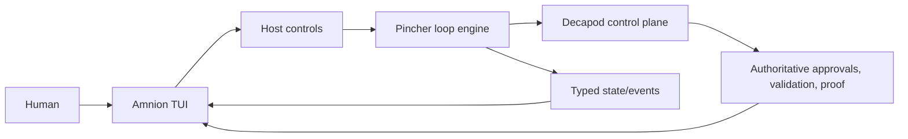

# Architecture

<!-- decapod:capability-overlay:persistent-state:start -->

## Persistent State Architecture Overlay

### State Ownership
- Each entity type MUST have a designated state owner
- State ownership boundaries MUST be explicitly documented
- Cross-boundary state access MUST go through defined interfaces

### Transaction Boundaries
- All multi-entity mutations MUST occur within explicit transactions
- Transaction boundaries MUST be documented in ARCHITECTURE.md
- Compensating transactions for distributed operations

### Storage Abstraction
- Storage ownership, consistency behavior, and access boundaries MUST be explicit
- Portability or swappable implementations are project decisions, not universal requirements
- Migration and rollback treatment MUST match the selected storage technology
<!-- decapod:capability-overlay:persistent-state:end -->

## Direction

Rust terminal application. Amnion is a host/projection layer, not an agent
runtime.

## Executive Summary

Amnion is a foreground terminal host that projects Pincher execution and
Decapod authority into a calm human-facing workflow.

## Runtime and Deployment Matrix

- Runtime: foreground Rust terminal process.
- Environment: local Decapod-managed repository/workspace.
- Deployment: local host; no service deployment owned by Amnion.

## Implementation Strategy

Build the smallest Pincher event/state projection first, then add detail views
and human controls only with authoritative result proof.

## Current Facts

- Runtime/language: Rust.
- Surfaces: Cargo and terminal UI.
- Product type: CLI host/projection.

## Architecture Map

- View model and TUI presentation.
- Pincher integration adapter.
- Decapod authority/query boundary.

## Data Flows

Pincher events and Decapod results enter the adapter, become a view projection,
and explicit human controls return through the governed owner.

## Topology

## System Topology

Human -> Amnion TUI -> Pincher -> Decapod; Pincher events and Decapod evidence
return to Amnion for projection.

## Store Boundaries

Amnion owns only ephemeral selection/filter/verbosity state. Decapod owns
durable governance records.

## Layer boundaries

- View model: calm projections of Pincher and Decapod state.
- Interaction layer: explicit user actions routed to Pincher/Decapod and
  confirmed by returned evidence.
- Integration adapter: consumes Pincher's typed state/events and reads the
  Decapod references needed for detail views.
- No provider, tool, retry, patch, or loop implementation belongs in Amnion.

## Strongest Existing Primitives

The current strongest primitives are the project context/specs and the planned
Pincher event/state consumer boundary.

## State ownership

| State | Owner | Amnion behavior |
| --- | --- | --- |
| Loop execution and event identity | Pincher | Render and retain references |
| Session, todo, workspace, approval, validation, proof | Decapod | Query/project; never replace |
| Selection, filters, verbosity, panel layout | Amnion | Local ephemeral view state |

## Runtime model

Amnion starts as a foreground local TUI. It refreshes from Pincher events and
Decapod authority, renders a quiet summary by default, and expands into detail
on demand. It must remain responsive while a loop runs, but background work is
owned by Pincher; Amnion only manages its view/update lifecycle.

## Execution Path

Load authority, render projection, route explicit control, await authoritative
result, and refresh.

## Happy Path Sequence

Read authority -> render state -> human opens detail -> route control -> show
authoritative result.

## Error Path

Unavailable, stale, contradictory, or blocked source data remains visible as
attention state and never becomes optimistic success.

## Concurrency and Runtime Model

Amnion remains a foreground view; Pincher owns background execution and event
production.

## Deployment Topology

Local terminal process; deployment and service hosting are outside scope.

## Data and Contracts

Pincher typed state/events and Decapod references are the integration contract.

## Schema and Data Contracts

Amnion consumes Pincher event/state values and Decapod references; it owns no
durable governance schema.

## API and ABI Contracts

The initial host boundary is typed Rust/local serialized data. A transported
contract requires explicit versioning and consumer proof.

## Validation Gates

Projection tests, contract fixtures, formatting/lints, and `decapod validate`
block promotion.

## Operational Planes

Amnion owns view responsiveness and readable attention states; Pincher owns
execution; Decapod owns custody and proof.

## Failure Topology and Recovery

Unavailable or stale sources remain visible, unsafe controls stop, and the view
refreshes from authoritative custody before resuming.

## Delivery Plan

1. Build the smallest event/state projection.
2. Add detail and attention views.
3. Add explicit controls and transport only with contract proof.

## Risks and Mitigations

| Risk | Mitigation |
| --- | --- |
| UI infers authority | retain source ids and wait for authoritative results |
| Runtime/UI contract drift | maintain paired Pincher and Amnion living specs |

## ADR Register

| ADR | Title | Status |
| --- | --- | --- |
| ADR-001 | Split UI host from loop engine | Accepted |

## Boundary decision

The Pincher split is intentional: Pincher provides execution semantics and
Amnion provides human experience. Any cross-repository change must update both
living interface specs and include a consumer proof.

<!-- decapod:codebase-attestation:start -->
## Codebase Attestation

- Repository signal fingerprint: `cbb46fea4ed69a2e244419b99c731f321e0d22223264c74afc034828705c58f2`
- Significant implementation surfaces: `.github/` (1 files), `README.md/` (1 files)
- Refreshed from the current codebase by `decapod specs.refresh`
<!-- decapod:codebase-attestation:end -->
