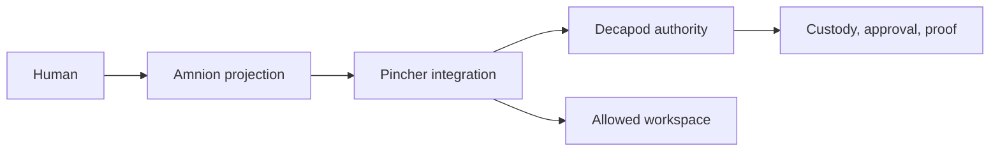

# Security

<!-- decapod:capability-overlay:public-api:start -->

## Public API Security Overlay

### Authentication Requirements
- All public endpoints MUST validate authentication tokens
- Token validation MUST include expiry, revocation, and scope checks
- Anonymous access MUST be explicitly documented and justified

### Input Validation
- All request bodies MUST be validated against schemas
- Reject requests with unknown fields (strict schema validation)
- Size limits MUST be enforced on all request bodies

### Rate Limiting
- Limits and enforcement boundaries MUST be selected for this deployment
- Clustered enforcement behavior MUST be documented when applicable
- Client-visible throttling behavior MUST be part of the contract when applicable
<!-- decapod:capability-overlay:public-api:end -->

## Threat Model

Amnion is a presentation client, not a trust root. It must treat Pincher
events and provider output as untrusted input for rendering, preserve
Decapod's approval/validation results, and avoid creating authority from
optimistic UI state.

## Authorization

Amnion never grants approval, proof, or promotion. Human actions are routed to
Pincher/Decapod and only authoritative results change the projection.

## Data Classification

| Class | Examples | Handling |
| --- | --- | --- |
| Public | status summaries and non-sensitive event metadata | renderable |
| Internal | custody refs, validation detail, source errors | scoped detail |
| Sensitive | credentials, tokens, raw secret-bearing content | never store/render |

## Controls

- Do not store session passwords, API keys, or raw secret-bearing prompts in
  view state or logs.
- Render only the scope and custody references returned by Pincher/Decapod.
- Require explicit confirmation for actions with human or repository impact;
  route the action through the governed owner.
- Keep claimed identity/provenance separate from verified identity. A local
  session is custody/correlation, not provider authentication.
- Preserve source errors and unknown events instead of hiding them.

## Threats and proof

| Threat | Mitigation | Proof |
| --- | --- | --- |
| UI spoofing of approval | show authoritative Decapod result/reference | projection tests |
| Scope confusion | render task/work-unit/workspace ids | integration fixture |
| Secret leakage | redaction and bounded detail views | security review |
| Malicious provider content | treat content as data, not UI instructions | rendering tests |

<!-- decapod:codebase-attestation:start -->
## Codebase Attestation

- Repository signal fingerprint: `cbb46fea4ed69a2e244419b99c731f321e0d22223264c74afc034828705c58f2`
- Significant implementation surfaces: `.github/` (1 files), `README.md/` (1 files)
- Refreshed from the current codebase by `decapod specs.refresh`
<!-- decapod:codebase-attestation:end -->
