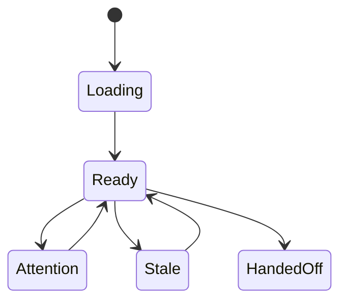
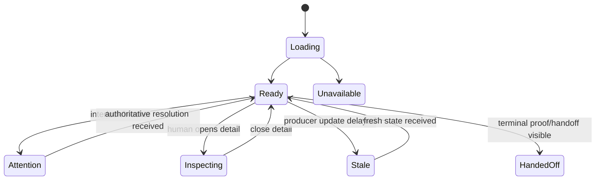

# Semantics

<!-- decapod:capability-overlay:persistent-state:start -->

## Persistent State Semantics Overlay

### Transaction Semantics
- All multi-entity operations MUST be atomic
- Read-after-write consistency within transaction boundaries
- Eventual consistency windows MUST be documented

### Migration Semantics
- Schema migrations MUST be backward-compatible
- Migration rollback procedures MUST be documented
- Data integrity checks post-migration

### Recovery Semantics
- Point-in-time recovery capability
- Recovery objectives MUST be selected for the project and recorded as proof obligations
- Recovery test cadence MUST be selected for the project and recorded as a proof obligation
<!-- decapod:capability-overlay:persistent-state:end -->

## State Machines

## View state

## Projection invariants

- A projection is never more authoritative than its Pincher/Decapod source.
- `ready`, `blocked`, `failed`, and `handed_off` retain the source identifiers
  and evidence references.
- Unknown, delayed, or contradictory source data is shown as attention/stale
  rather than silently normalized into success.
- A human action changes view state only after its authoritative result returns.
- Quiet mode may summarize events, but detail mode can recover the full event
  identity and source context.

## Invariants

| Invariant | Enforcement |
| --- | --- |
| A projection cannot grant authority | only Pincher/Decapod results change authoritative status |
| Source identity is preserved | retain event, run, custody, and proof references |
| Stale or unknown data is visible | render attention/stale rather than optimistic success |
| Human controls are confirmed | wait for authoritative result before updating status |

## Attention semantics

Human attention is required for an unresolved Decapod interlock, missing
custody, validation/proof failure, or an explicit handoff decision. Ordinary
provider activity is not an attention state.

<!-- decapod:codebase-attestation:start -->
## Codebase Attestation

- Repository signal fingerprint: `cbb46fea4ed69a2e244419b99c731f321e0d22223264c74afc034828705c58f2`
- Significant implementation surfaces: `.github/` (1 files), `README.md/` (1 files)
- Refreshed from the current codebase by `decapod specs.refresh`
<!-- decapod:codebase-attestation:end -->
